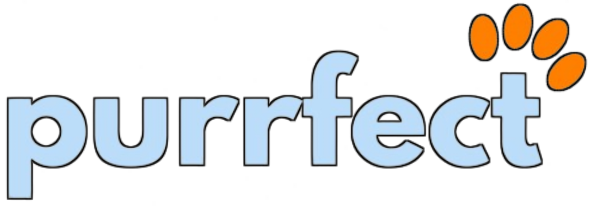

  

# PurrfectPal
**Submitted to:** Hack This Fall (by MLH)

**Problem Statement:**
Pet owners need a reliable and secure platform to find suitable caretakers for their pets when they are away.
Individuals interested in adopting pets lack a centralized and trustworthy source to connect with pet owners and get.

**Solution:**
We are introducing "Purrfect Pal" - an innovative app acting as an intermediary between pet owners and potential adopters.

**Features:**

* **Pet Listings:**  Pet owners can list their pets, specifying whether it's for a temporary period or permanent adoption.
* **Search and Match:** Adopters can search for pets based on preferences and connect with suitable matches.
* **Secure Agreements:** A built-in agreement system to ensure the safety and well-being of pets during transitions.
* **User Profiles:** Detailed profiles for both pet owners and adopters to build trust and understanding.
* **Communication Interface:** An integrated chat system for users to communicate and finalize details.
* **Verification Process:** A robust verification process for pet owners and adopters.

**Tech Stack:** 
* ReactJS (Frontend)
* Django (Backend)
* Postgres (Database)
* Java (Android application)
* Neurelo (to query Database)
